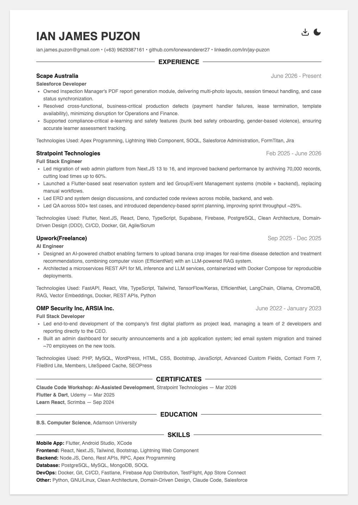
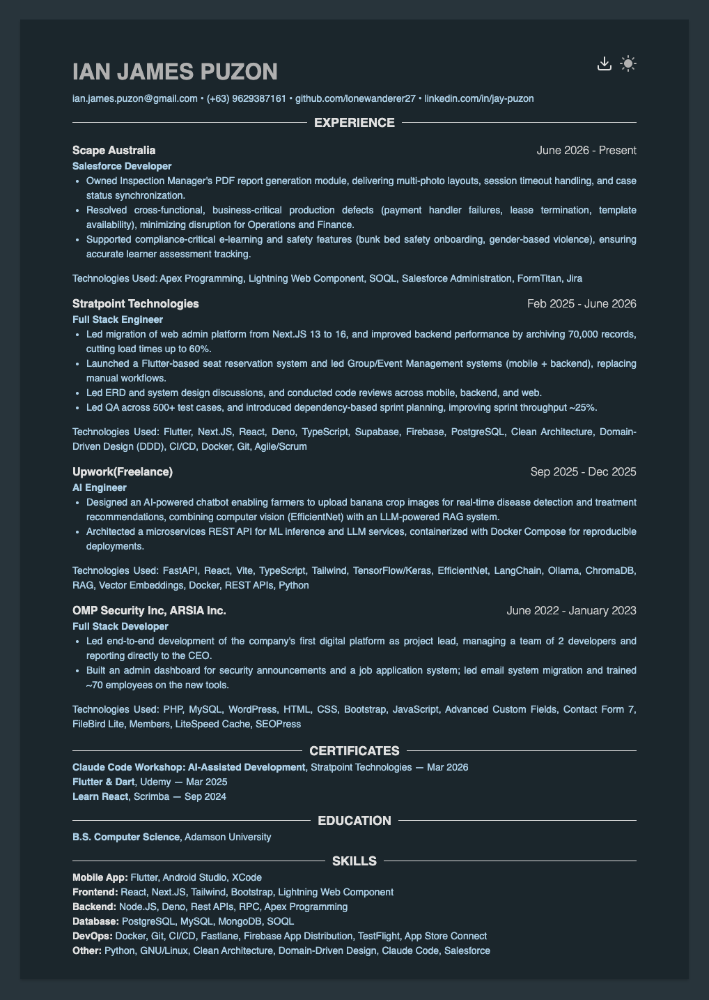

# My Resume | Astro

A lightweight, mobile-responsive Harvard-style resume template built with Astro. This project supports dark mode and is highly customizable. Perfect for showcasing your professional experience, skills, and projects.
<br><br>

Copyright © 2026 Adriane James </br>


## Features
- Lightweight
- Free & Open Source
- Mobile Responsive
- Dark Mode Support


## Project Structure

Inside of this project, you'll see the following folders and files:

```text
/
├── public/
├── src/
│   ├── components/
│   │   ├── CareerProfile.astro
│   │   ├── Certificates.astro
│   │   ├── Contact.astro
│   │   ├── Education.astro
│   │   ├── Experience.astro
│   │   ├── Head.astro
│   │   ├── Header.astro
│   │   ├── Languages.astro
│   │   ├── Mock.astro
│   │   ├── Projects.astro
│   │   ├── Publications.astro
│   │   ├── References.astro
│   │   ├── Skills.astro
│   │   └── Volunteering.astro
│   ├── layouts/
│   │   └── Layout.astro
│   ├── pages/
│   │   └── index.astro
│   ├── styles/
│   │   └── mixins.scss
│   ├── config.ts
│   ├── data.ts
│   ├── mockData.ts
│   └── types.ts
└── package.json
```

Site config (title, dark mode toggle, canonical URL) lives in `config.ts`.

Resume content (contact, education, experience, skills, projects, etc.) lives in `data.ts` — just change a value and Astro will rebuild the site for you.

All available fields and their types can be seen in `types.ts`.

Markup, styling and script files are contained in their respective astro component.

Site is deployed under the `/resume` base path (see `astro.config.mjs`).

### Mock data mode

Setting env var `USE_MOCK_DATA=true` (see `.env.example`) makes `index.astro` render `Mock.astro` (backed by `mockData.ts`) instead of the real data — useful for testing layout changes without touching real resume data.


## Commands

Package manager is pnpm, though npm-style scripts also work.

| Command                    | Action                                           |
| :-------------------------- | :----------------------------------------------- |
| `pnpm install`              | Installs dependencies                            |
| `pnpm run dev`               | Starts local dev server at `localhost:4321`      |
| `pnpm run build`             | Runs `astro check` then builds to `./dist/`      |
| `pnpm run preview`           | Preview build locally, before deploying          |
| `pnpm run astro -- <cmd>`    | Run CLI commands like `astro add`, `astro check` |
| `pnpm run astro -- --help`   | Get help using the Astro CLI                     |

No test suite or linter is configured — `astro check` (part of `build`) is the only type/consistency check.

## CI/CD

- `.github/workflows/deploy.yml` — builds and deploys to GitHub Pages on push to `master`.
- `.github/workflows/upload-pdf-to-release.yml` — after deploy, renders the live site to PDF and publishes it as a dated GitHub release asset.


## Preview

