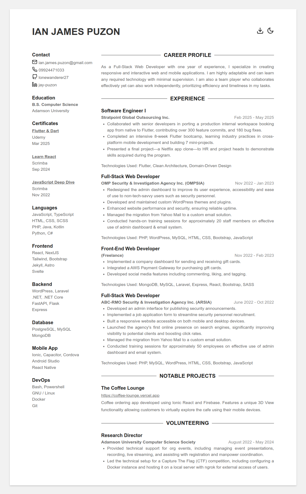
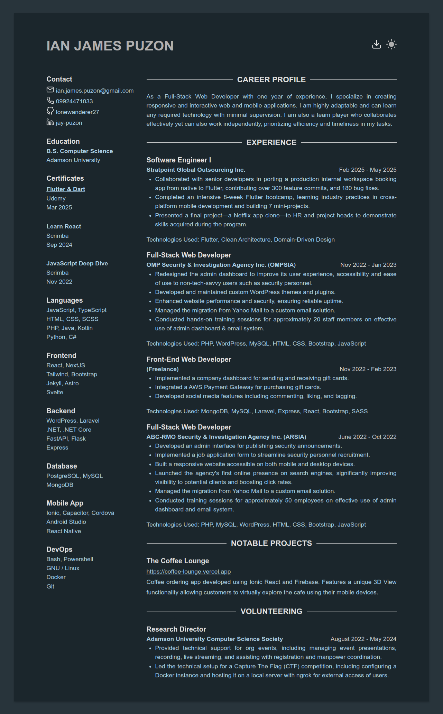

# My Resume | Astro

Copyright © 2024 Adriane James </br>
Original Jekyll developed and designed by [Stavrospanakakis](https://github.com/Stavrospanakakis) 
Astro version developed and improved by [lonewanderer27](https://github.com/lonewanderer27)


## Features
- Lightweight
- Free & Open Source
- Mobile Responsive
- Dark Mode Support


## Project Structure

Inside of this project, you'll see the following folders and files:

```text
/
├── public/
├── src/
│   ├── components/
│   │   ├── CareerProfile.astro
│   │   ├── Certificates.astro
│   │   ├── Contact.astro
│   │   ├── Education.astro
│   │   ├── Experience.astro
│   │   ├── Head.astro
│   │   ├── Header.astro
│   │   ├── Languages.astro
│   │   ├── Projects.astro
│   │   ├── Publications.astro
│   │   ├── Skills.astro
│   │   └── Volunteering.astro
│   ├── layouts/
│   │   └── Layout.astro
│   ├── pages/
│   │   └── index.astro
│   ├── styles/
│   │   └── mixins.scss
│   ├── data.ts
│   └── types.ts
└── package.json
```

Site configuration is contained in data.ts, just change a value and Astro will rebuild the site for you. 

All available fields and their types can be seen in types.ts

Markup, styling and script files are contained in their respective astro component.


## Commands

| Command                   | Action                                           |
| :------------------------ | :----------------------------------------------- |
| `npm install`             | Installs dependencies                            |
| `npm run dev`             | Starts local dev server at `localhost:4321`      |
| `npm run build`           | Build production site to `./dist/`               |
| `npm run preview`         | Preview build locally, before deploying          |
| `npm run astro ...`       | Run CLI commands like `astro add`, `astro check` |
| `npm run astro -- --help` | Get help using the Astro CLI                     |


## Preview

